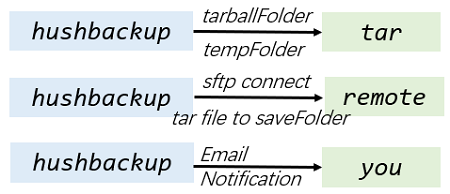

# hushbackup

This tool backups a certain folder as .tar archive and uploads it to another server via SFTP (SSH based) with Email notification.



## Download

Visit [Releases](https://github.com/z0gSh1u/hushbackup/releases) to grab the binary for your machine. hushbackup is portable with only a binary file and nothing else.

Or compile yourself by checking [build.cmd](./build.cmd) / [build.sh](./build.sh).

## Single Run

Execute

```sh
hushbackup-1.0-linux-amd64 config.json
```

Here is the guide for [configuration file](./config.json).

```
{
  "source": {
    "tarballFolder": "/home/me/important_code", // the folder you want to backup
    "tempFolder": "/mnt/hdd1/temp" // a temporary path to save .tar file of tarballFolder
  },
  "target": {
    "host": "10.1.2.3", // ip of the machine you want to upload to
    "port": "22", // SFTP port
    "username": "me", // the username to login target machine
    "password": "123456", // the corresponding password
    "saveFolder": "/mnt/hdd1/bak" // the directory to store the transferred .tar file
  },
  "notification": {
    "smtp": "smtp.qq.com", // SMTP server of sender
    "port": "465", // port of SMTP server
    "from": "123@qq.com", // sender's address
    "to": "456@qq.com", // receiver's address. keep empty to disable email notification
    "username": "123@qq.com", // sender's username, usually same as `from`
    "password": "abcdef123456" // sender's password (or authentication code)
  }
}
```

:warning: **The config file contains plaintext passwords, so remember to set a suitable permission.**

```sh
chmod 700 config.json
```

## Scheduled Task

We can use [crontab](https://www.google.com/search?q=crontab) to set up scheduled task to backup periodically.

```sh
crontab -e

# Run at everyday's 03:30.
30 3 * * * /path/to/hushbackup-1.0-linux-amd64 /path/to/config.json > /path/to/log.log
```

## Roadmap

- Support Public Key authentication
- Support gzip to get .tar.gz

## License

[MIT](./LICENSE)

Means that I take no responsibility for any results brought by the software.